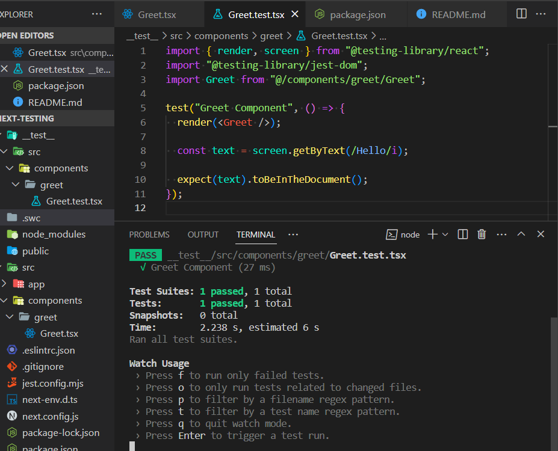

# React Testing Practice - Nextjs v13.4.7

This is a practical [Next.js](https://nextjs.org/) project bootstrapped with [`create-next-app`](https://github.com/vercel/next.js/tree/canary/packages/create-next-app) for practicing **Jest & RTL**. This project is my practice for [React-Testing Course](https://www.youtube.com/watch?v=T2sv8jXoP4s&list=PLC3y8-rFHvwirqe1KHFCHJ0RqNuN61SJd) from [Codevolution Channel](https://www.youtube.com/@Codevolution/).

Here is Nextjs [documentation](https://nextjs.org/docs/pages/building-your-application/optimizing/testing#jest-and-react-testing-library) for using Jest and RTL.

## Technologies

- TSX, Tailwindcss,
- TypeScript
- **Nextjs v13.4.1**
- **Jest & RTL**

## Features

- Automated testing
- TDD test
- Filter using **.only** and **.skip**
- Group tests using **describe(name,fun)**
- Use **it** as an alternative to test method, (xit,fit=,test.skip,test.only)

## Installation

###### shell command

```shell
npm install

npm run dev

npm run test
```

## Screenshots


